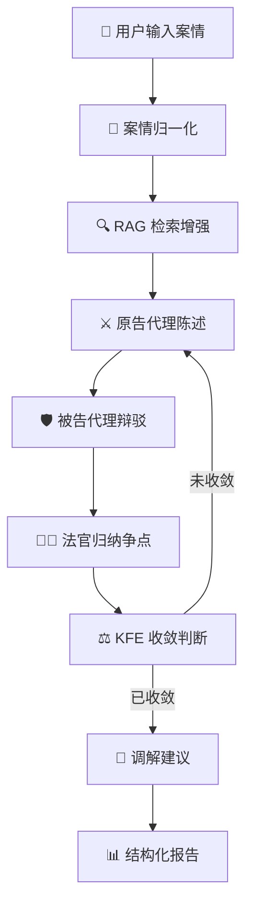
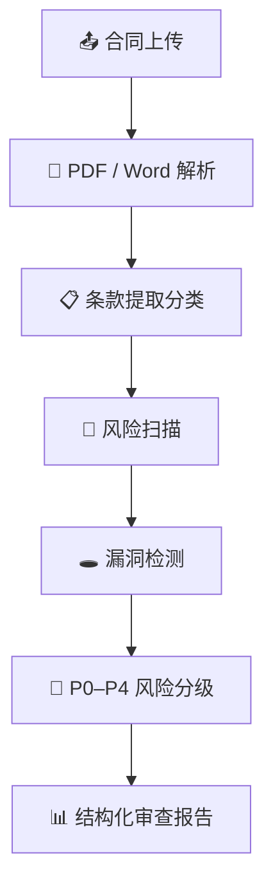
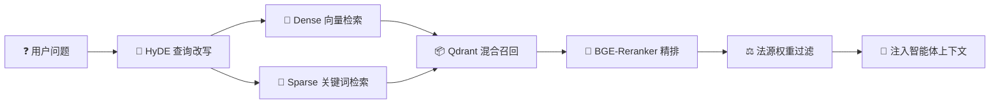

<div align="center">


<p>
  
  
  
  
</p>

<p>
  
  
  
  
  
  <br>
  
  
  
  
  
</p>

<br>

<h3>基于 LangGraph 多智能体 + RAG 混合检索的智能法律工作台</h3>

<p>
  🏛️ <b>模拟法庭推演</b> &nbsp;·&nbsp;
  📄 <b>合同智能审查</b> &nbsp;·&nbsp;
  🔍 <b>法律知识检索</b>
</p>

<p>
  <sub>提供可解释 · 可追溯 · 可流式交互的 AI 法律辅助系统</sub>
</p>

<br>

<p>
  <a href="#-快速开始"></a>
  &nbsp;
  <a href="#-核心工作流"></a>
</p>

<br>

---

</div>

> [!IMPORTANT]
> **法律 AI 辅助定位** — 本项目定位为 AI 辅助工具，不替代律师或司法机关的专业判断。输出内容仅供学习、科研与竞赛展示，因使用系统输出所产生的任何决策和后果，应由使用者自行承担。

---

## 📖 目录

<details open>
<summary><b>点击展开 / 折叠</b></summary>

- [✨ 功能亮点](#-功能亮点)
- [🏗️ 系统架构](#️-系统架构)
- [🛠️ 技术栈](#️-技术栈)
- [📁 项目结构](#-项目结构)
- [🚀 快速开始](#-快速开始)
- [📚 法律知识库导入](#-法律知识库导入)
- [🔄 核心工作流](#-核心工作流)
- [📡 API 概览](#-api-概览)
- [📊 测试指标](#-测试指标)
- [🔒 安全合规](#-安全合规)
- [🗺️ 路线图](#️-路线图)
- [❓ 常见问题](#-常见问题)

</details>

---

## ✨ 功能亮点

<table align="center">
  <tr>
    <td align="center" width="33%">
      <br>
      <h3>🏛️ 模拟法庭推演</h3>
      <p align="left">
        <b>多角色协作：</b>原告代理 → 被告辩驳 → 法官争点归纳 → 调解员介入<br>
        <b>智能驱动：</b>LangGraph 多智能体编排，SSE 实时流式输出<br>
        <b>可追溯：</b>证据链 + 法条引用 + 结构化报告
      </p>
    </td>
    <td align="center" width="33%">
      <br>
      <h3>📄 合同智能审查</h3>
      <p align="left">
        <b>多格式支持：</b>PDF / Word / TXT 上传解析<br>
        <b>风险分层：</b>P0–P4 五级风险矩阵 + 频次分布<br>
        <b>原文对照：</b>双标签页一目了然
      </p>
    </td>
    <td align="center" width="33%">
      <br>
      <h3>🔍 RAG 混合检索</h3>
      <p align="left">
        <b>三重召回：</b>Dense 向量 + Sparse BM25 + Rerank 精排<br>
        <b>海量知识：</b>97,000+ 法条 + 50,000+ 裁判文书<br>
        <b>HyDE 增强：</b>查询改写提升语义命中率
      </p>
    </td>
  </tr>
  <tr>
    <td align="center">
      <br>
      <h3>🧠 DeepSeek 双轨路由</h3>
      <p align="left">
        <b>分级调用：</b>V4-Pro 高精度推理 & V4-Flash 高频轻量<br>
        <b>统一代理：</b>LiteLLM 按需自动切换、限流、回退<br>
        <b>节约成本：</b>智能路由降低 30%–50% API 开销
      </p>
    </td>
    <td align="center">
      <br>
      <h3>🐳 一键部署</h3>
      <p align="left">
        <b>容器化：</b>Docker Compose 6 服务编排<br>
        <b>可观测：</b>Prometheus 指标 + 内存监控<br>
        <b>高可靠：</b>Redis 会话缓存 + PostgreSQL 持久化
      </p>
    </td>
    <td align="center">
      <br>
      <h3>🛡️ 工程可靠</h3>
      <p align="left">
        <b>异常恢复：</b>LangGraph checkpointer 断点续推<br>
        <b>降级策略：</b>核心必成功 + 非核心可降级<br>
        <b>幂等设计：</b>唯一 call_id + 30s 超时熔断
      </p>
    </td>
  </tr>
</table>

---

## 🏗️ 系统架构

```
┌──────────────────────────────────────────────────────────────────┐
│                         🌐  Frontend                              │
│    Next.js 14 · React 18 · TypeScript · Zustand · Tailwind CSS    │
│    三栏式工作台 · SSE 流式对话 · 拖拽上传 · 证据法条面板           │
└──────────────────────────────┬───────────────────────────────────┘
                               │  HTTP / SSE (JWT Auth)
┌──────────────────────────────▼───────────────────────────────────┐
│                         ⚙️  Backend                               │
│   FastAPI Gateway · JWT Auth · Document Parser · Prometheus       │
│   LangGraph Workflows · Agent Services · RAG Hybrid Retriever     │
└──────┬───────────────┬───────────────────┬───────────────────────┘
       │               │                   │
  ┌────▼────┐   ┌──────▼──────┐   ┌───────▼──────┐
  │  Redis  │   │ PostgreSQL  │   │    Qdrant    │
  │ Session │   │  + pgvector │   │ Vector Store │
  └─────────┘   └─────────────┘   └──────────────┘
       │
  ┌────▼─────────────────────────┐
  │     🧠 LiteLLM / DeepSeek    │
  │     V4-Pro  ·  V4-Flash      │
  └──────────────────────────────┘
```

---

## 🛠️ 技术栈

### 🔧 后端

<table>
  <tr>
    <th width="160">类别</th>
    <th width="240">技术</th>
    <th>说明</th>
  </tr>
  <tr>
    <td>🖥️ 框架</td>
    <td><code>FastAPI</code> + <code>Uvicorn</code></td>
    <td>API Gateway、SSE 流式推送、异步处理</td>
  </tr>
  <tr>
    <td>🔄 工作流</td>
    <td><code>LangGraph</code></td>
    <td>多智能体状态机、条件边、中断恢复</td>
  </tr>
  <tr>
    <td>🧠 AI 模型</td>
    <td><code>DeepSeek V4-Pro / V4-Flash</code></td>
    <td>高精度推理 & 高频轻量任务分级调用</td>
  </tr>
  <tr>
    <td>🔌 代理层</td>
    <td><code>LiteLLM Proxy</code></td>
    <td>统一模型路由、限流、缓存、回退</td>
  </tr>
  <tr>
    <td>🗂️ 向量库</td>
    <td><code>Qdrant</code></td>
    <td>法律知识库向量检索</td>
  </tr>
  <tr>
    <td>💾 数据库</td>
    <td><code>PostgreSQL 16</code> + <code>pgvector</code></td>
    <td>结构化数据、向量扩展、检查点持久化</td>
  </tr>
  <tr>
    <td>⚡ 缓存</td>
    <td><code>Redis</code></td>
    <td>会话缓存、热点结果缓存</td>
  </tr>
  <tr>
    <td>📖 文档解析</td>
    <td><code>PyMuPDF</code> / <code>python-docx</code></td>
    <td>PDF、Word 合同文本提取</td>
  </tr>
  <tr>
    <td>🧬 文本嵌入</td>
    <td><code>Qwen3-Embedding-0.6B</code></td>
    <td>1024 维中文法律文本向量</td>
  </tr>
  <tr>
    <td>🎯 精排</td>
    <td><code>BGE-Reranker</code></td>
    <td>候选法律片段重排序</td>
  </tr>
  <tr>
    <td>📊 监控</td>
    <td><code>Prometheus</code></td>
    <td>HTTP 指标、LLM 调用量、内存告警</td>
  </tr>
</table>

### 🎨 前端

<table>
  <tr>
    <th width="160">类别</th>
    <th width="240">技术</th>
    <th>说明</th>
  </tr>
  <tr>
    <td>⚛️ 框架</td>
    <td><code>Next.js 14</code> + <code>React 18</code></td>
    <td>SSR + 客户端渲染</td>
  </tr>
  <tr>
    <td>📐 语言</td>
    <td><code>TypeScript</code></td>
    <td>类型安全</td>
  </tr>
  <tr>
    <td>🗃️ 状态管理</td>
    <td><code>Zustand</code></td>
    <td>轻量响应式状态</td>
  </tr>
  <tr>
    <td>🎨 样式</td>
    <td><code>Tailwind CSS</code> + <code>Framer Motion</code></td>
    <td>原子化 CSS + 流畅动画</td>
  </tr>
  <tr>
    <td>📡 通信</td>
    <td><code>ReadableStream SSE</code></td>
    <td>流式对话实时渲染</td>
  </tr>
</table>

### 🏗️ 基础设施

<table>
  <tr>
    <th width="160">工具</th>
    <th width="480">用途</th>
  </tr>
  <tr>
    <td>🐳 <code>Docker Compose</code></td>
    <td>6 服务一键编排（Redis + PostgreSQL + Qdrant + LiteLLM + 前后端）</td>
  </tr>
  <tr>
    <td>🪟 <code>WSL2 Ubuntu</code></td>
    <td>Windows 下的 Linux 开发环境</td>
  </tr>
  <tr>
    <td>📊 <code>Prometheus</code></td>
    <td>指标采集、内存监控、显存告警</td>
  </tr>
</table>

---

## 📁 项目结构

<details>
<summary><b>📂 点击展开完整目录树</b></summary>

```
LegalMind-AI/
├── backend/                                # 🐍 FastAPI 后端
│   ├── app/
│   │   ├── main.py                         #   入口 · 生命周期 · 内存监控
│   │   ├── core/                           #   配置 · 认证 · 数据库 · LLM 客户端
│   │   ├── routers/gateway.py              #   API 路由 · SSE 流 · 文档管理
│   │   ├── services/
│   │   │   ├── agents/                     #   原告 · 被告 · 法官 · 调解员 · 合同审查员
│   │   │   ├── legal/                      #   RAG 混合检索 · BM25 · KFE 提取
│   │   │   └── workflows/                  #   辩论 · 合同审查 · 法律咨询工作流
│   │   └── sql/init/                       #   PostgreSQL 初始化脚本
│   ├── scripts/import_all.py               #   向量知识库统一导入（断点续传）
│   ├── requirements.txt
│   └── Dockerfile
│
├── frontend/                               # ⚛️ Next.js 前端
│   ├── app/
│   │   ├── page.tsx                        #   法律对话首页
│   │   ├── court/page.tsx                  #   模拟法庭推演
│   │   ├── documents/page.tsx              #   合同审查工作台
│   │   └── lib/api.ts                      #   API 客户端 · SSE 封装
│   ├── components/
│   │   ├── ChatInterface.tsx               #   流式对话组件
│   │   ├── DocumentUpload.tsx              #   合同上传 + 双标签页审查
│   │   ├── RightPanel.tsx                  #   法规 · 证据侧边面板
│   │   └── Sidebar.tsx                     #   深蓝导航栏
│   ├── store/useChatStore.ts               #   Zustand 全局状态
│   ├── package.json
│   └── Dockerfile
│
├── litellm/config.yaml                     # LiteLLM 模型路由配置
├── docker-compose.yml                      # 生产级 6 服务编排
├── deploy/                                 # 简化部署配置
├── .env.example                            # 环境变量模板
└── README.md
```

</details>

> [!NOTE]
> `data/` `models/` `uploads/` 等目录因体积或隐私原因已加入 `.gitignore`，不会提交到 Git。

---

## 🚀 快速开始

### 📋 环境要求

| 依赖 | 最低版本 | 说明 |
|------|:--------:|------|
|  Python | `≥ 3.10` | 后端运行时 |
|  Node.js | `≥ 18` | 前端运行时 |
|  Docker | `≥ 24` | 基础设施容器化 |
|  Git | `≥ 2.30` | 版本管理 |
| 🔥 CUDA | `≥ 11.8` | GPU 推理（可选） |

### 步骤一：克隆项目

```bash
git clone https://github.com/nihong2077/LegalMind-AI.git
cd LegalMind-AI
```

### 步骤二：配置环境变量

```bash
cp .env.example .env
```

编辑 `.env`，填入你的真实密钥：

```env
# ========== 安全认证（必填） ==========
JWT_SECRET_KEY=<openssl rand -hex 32 生成>
ADMIN_PASSWORD=<你的管理员密码>

# ========== AI 模型（必填） ==========
DEEPSEEK_API_KEY=<你的 DeepSeek API Key>
LITELLM_MASTER_KEY=<LiteLLM 主密钥>
LITELLM_VIRTUAL_KEY=<LiteLLM 虚拟密钥>
```

### 步骤三：启动基础设施

```bash
# 启动核心服务
docker compose up -d redis postgres qdrant litellm-db litellm

# 等待全部 healthy
docker compose ps
```

### 步骤四：启动后端

```bash
cd backend
python3 -m venv venv && source venv/bin/activate
pip install -r requirements.txt

# 启动开发服务器
uvicorn app.main:app --host 0.0.0.0 --port 8000 --reload
```

> 访问 [http://localhost:8000/docs](http://localhost:8000/docs) 查看 Swagger API 文档。

### 步骤五：启动前端

```bash
cd frontend
npm install && npm run dev
```

> 访问 [http://localhost:3000](http://localhost:3000) 进入 LegalMind AI 工作台。

### 🐳 一键部署 (Docker)

```bash
# 构建并启动全部 6 个服务
docker compose up -d --build

# 查看运行状态
docker compose logs -f --tail=50
```

---

## 📚 法律知识库导入

> 首次运行需导入法规、案例与裁判文书数据。

```bash
cd backend && source venv/bin/activate

# 全量导入（支持断点续传）
python scripts/import_all.py --resume

# 仅验证已有数据
python scripts/import_all.py --verify-only

# 跳过指定数据源
python scripts/import_all.py --resume --skip-lawyer
```

**导入流程：**

```
文本清洗 → 分段切片 → 向量嵌入 → 写入 Qdrant → 记录断点
```

> [!TIP]
> 知识库数据文件较大，未包含在 Git 仓库中。若需使用完整知识库，请自行准备 `data/` 目录下的数据文件。导入脚本支持断点续传，中断后重新执行会自动跳过已完成的文件。

---

## 🔄 核心工作流

### 🏛️ 模拟法庭推演



### 📄 合同审查流程



### 🔍 RAG 混合检索流程



---

## 📡 API 概览

| 端点 | 方法 | 认证 | 说明 |
|------|:----:|:----:|------|
| `/api/auth/token` | `POST` | — | 登录获取 JWT Token |
| `/api/chat/stream` | `SSE` | 🔑 | 智能法律对话流 |
| `/api/debate/stream` | `SSE` | 🔑 | 模拟法庭推演流 |
| `/api/contract-review/stream` | `SSE` | 🔑 | 合同审查流式输出 |
| `/api/documents/upload` | `POST` | 🔑 | 上传合同或证据文件 |
| `/api/documents/{id}/content` | `GET` | 🔑 | 获取文档解析内容 |
| `/api/knowledge/search` | `POST` | 🔑 | 法律知识混合检索 |
| `/health` | `GET` | — | 健康检查 |
| `/metrics` | `GET` | — | Prometheus 指标 |

---

## 📊 测试指标

> [!NOTE]
> 当前处于竞赛原型与工程验证阶段，以下指标为**开发环境实测**，仅供参考。

<table>
  <tr>
    <th width="240">指标</th>
    <th width="140">观测值</th>
    <th>说明</th>
  </tr>
  <tr>
    <td>🔄 中断恢复成功率</td>
    <td><code>≈ 90%–94%</code></td>
    <td>LangGraph checkpointer 恢复</td>
  </tr>
  <tr>
    <td>🔀 条件边路由准确率</td>
    <td><code>≈ 88%–92%</code></td>
    <td>意图分类 → 节点路由</td>
  </tr>
  <tr>
    <td>📚 关键法条 Top-5 召回率</td>
    <td><code>≈ 80%–85%</code></td>
    <td>Hybrid + Rerank 后</td>
  </tr>
  <tr>
    <td>⚠️ KFE 收敛误判率</td>
    <td><code>≈ 7%–10%</code></td>
    <td>争议焦点收敛判断</td>
  </tr>
  <tr>
    <td>⚡ 首字可见延迟 P95</td>
    <td><code>≈ 2–3s</code></td>
    <td>SSE 流首 token</td>
  </tr>
  <tr>
    <td>⏱️ 完整案件链路 P95</td>
    <td><code>≈ 45–60s</code></td>
    <td>从输入到报告生成</td>
  </tr>
  <tr>
    <td>📄 合同审查 P95</td>
    <td><code>≈ 25–35s</code></td>
    <td>上传到风险矩阵输出</td>
  </tr>
  <tr>
    <td>💰 单次案件 API 成本</td>
    <td><code>≈ ¥0.80–2.50</code></td>
    <td>DeepSeek 计费</td>
  </tr>
</table>

**运行测试：**

```bash
cd backend && pytest                                        # 后端单元测试
cd frontend && npm run lint && npm run build               # 前端静态检查
```

---

## 🔒 安全合规

> [!WARNING]
> **安全必读**
> - 本系统输出 **仅供参考**，不构成正式法律意见
> - 生产环境 **必须更换** 所有默认密钥和密码
> - **切勿**将用户上传的合同、证据、聊天记录提交到 Git

**`.gitignore` 排除规则：**

| 类别 | 排除内容 |
|------|----------|
| 🔑 密钥 | `.env` `*.pem` `*.key` `credentials.*` |
| 🧠 模型 | `models/` `*.safetensors` `*.bin` `*.gguf` `*.onnx` `*.pt` |
| 🗂️ 向量库 | `data/qdrant_data/` `*.sqlite` `*.lock` |
| 📤 用户上传 | `backend/uploads/` |
| 📊 数据集 | `data/lawyer/CAIL2018/` `data/judge/` |
| 📝 日志 | `*.log` |

---

## 🗺️ 路线图

| 状态 | 功能 |
|:----:|------|
| ✅ | 模拟法庭多智能体推演 |
| ✅ | 合同 P0–P4 五级风险审查 |
| ✅ | RAG 混合检索 + Rerank 精排 |
| ✅ | DeepSeek 双轨路由 |
| ✅ | Docker Compose 一键部署 |
| 🚧 | 更多民事案由模板 |
| 🚧 | 合同审查规则库增强 |
| 📋 | 法规更新自动监控 |
| 📋 | 审查报告导出 PDF / Word |
| 📋 | 移动端适老化交互优化 |
| 📋 | GitHub Actions CI/CD |

---

## ❓ 常见问题

<details>
<summary><b>⚖️ 这个系统可以直接当律师用吗？</b></summary>

**不能。** 系统只能提供辅助分析、检索和风险提示，**不能替代** 律师、法院或仲裁机构的专业判断。详见上方免责声明。
</details>

<details>
<summary><b>🖥️ 没有 GPU 可以运行吗？</b></summary>

**可以**，但嵌入模型和检索速度会明显下降。建议演示和正式评估阶段优先使用 GPU 环境。
</details>

<details>
<summary><b>🤔 为什么要用 LangGraph？</b></summary>

法律任务不是简单的一问一答，而是包含**多轮状态、证据补充、角色协同、分支判断和报告生成**的长流程任务。LangGraph 的图式工作流更适合表达这种复杂逻辑，并且原生支持 checkpoint 断点恢复。
</details>

<details>
<summary><b>🔍 为什么要混合检索？</b></summary>

法律文本既需要**语义匹配**（同义词、相近表述），也需要**精确匹配**（法条编号、关键词、主体、金额、日期）。Dense + Sparse + Rerank 三层策略能显著减少单一向量检索的语义漂移。
</details>

<details>
<summary><b>🔌 如何添加新的 LLM 模型？</b></summary>

编辑 `litellm/config.yaml` 添加模型配置，重启 LiteLLM 容器即可。后端通过 LiteLLM 代理层统一调用，**无需修改业务代码**。
</details>

<details>
<summary><b>📦 项目依赖安装失败怎么办？</b></summary>

建议使用 **Docker Compose 一键部署**，避免环境差异问题。手动安装时，确保 Python ≥ 3.10、Node.js ≥ 18，并按顺序安装 `requirements.txt`。
</details>

---

## 📄 许可证

本项目采用 [MIT License](LICENSE)。

---

## ⚠️ 免责声明

本项目仅用于 **学习、科研、竞赛展示** 和 **法律 AI 工程实践探索**。系统输出 **不构成法律意见、律师意见或司法结论**。因使用系统输出所产生的任何决策和后果，应由使用者自行承担。

---

<div align="center">

<br>


<sub>Built with ❤️ by <b>LegalMind AI Team</b> &nbsp;|&nbsp; © 2025</sub>

</div>